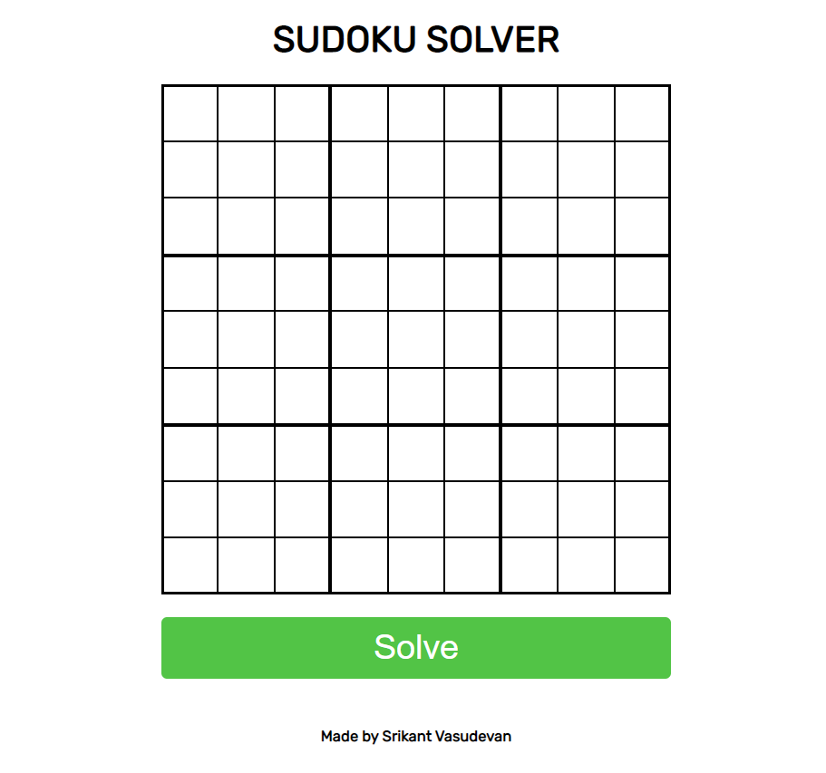

# Sudoku-Solver (unfinished)

This is just a simple side-project which combines my recreational hobby of sudoku with my programming. This is an attempt to make an algorithm by myself, pooling little to no outside help and mapping the logic individually.

## Inner Workings

The core algorithm, located in the main.py file, is comprised of a series of "helper functions" (abstractions) and one large, recursive solve function. With the use of the abstractions, the recursive function uses the following workflow to determine a solution for the inputted sudoku puzzle.

## API Details

The api interface for this algorithm is fairly simple to set up and use. The api uses tornado and listens on port 3000. To run the api, simply load all of the packages and run the main.py file on whatever interface you please. The gui will assume the api is running on localhost:3000, but if it is through a different IP, you are able to change that detail in the code!

## GUI Details

The gui for this application serves the purpose of calling the api in a non-programmatic way. The gui is set with a 9x9 sudoku grid in which the user is able to input the known values (sudoku clues) and send the puzzle to the api to solve. In some cases, the api is unable to solve the puzzle, and when this happens, the api will just send 0s for each square it is unable to find the number for.

The following is the layout of the gui:

